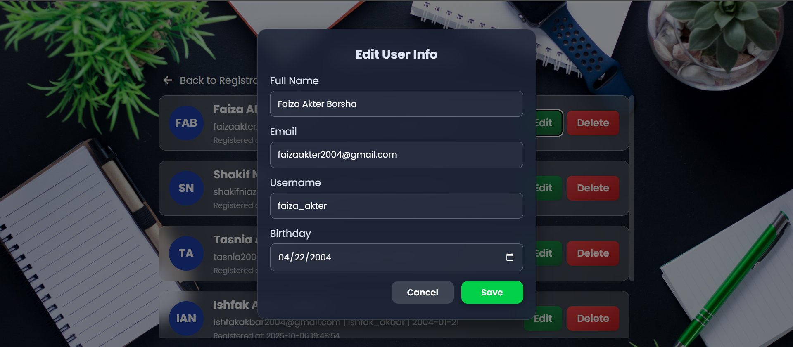

# User Registration 

A **modern, responsive web application** built with **PHP**, **MySQL**, **HTML**, **CSS**, **JavaScript**, and **Tailwind CSS** for managing user registration, viewing, editing, and deleting user data — all through a seamless interactive interface.

This project demonstrates how to create a **clean, modular PHP system** that interacts with the backend through **AJAX requests**, separating logic from presentation and enhancing performance and maintainability.

---

## 🚀 Features

* ✅ **User Registration** — Register new users with validation and instant feedback.
* 🔍 **View Registered Users** — Display all users in a beautiful, responsive Tailwind-styled stacked list.
* ✏️ **Edit & Update Data** — Edit user info dynamically using a modal interface.
* ❌ **Delete Users** — Remove users instantly via AJAX, without reloading the page.
* 🕒 **Timestamps** — Display `created_at` for each registered user.
* ⚡ **AJAX-Powered CRUD** — Data fetched and updated asynchronously using JavaScript.
* 🎨 **Responsive UI** — Clean, modern, and mobile-friendly layout with Tailwind CSS.
* 🔗 **Fully Separated Files** — Independent HTML, CSS, JS, and PHP for better structure and scalability.

---

## 🧠 Technologies Used

| Technology            | Purpose                                                    |
| --------------------- | ---------------------------------------------------------- |
| **HTML5**             | Structure and layout of the web pages                      |
| **CSS3**              | Custom styling and layout adjustments                      |
| **Tailwind CSS**      | Utility-first CSS framework for sleek and responsive UI    |
| **JavaScript (AJAX)** | Frontend logic and asynchronous communication with backend |
| **PHP (MySQLi)**      | Backend logic for database operations                      |
| **MySQL**             | Database for storing and managing user information         |
| **XAMPP**             | Localhost environment for running PHP and MySQL            |

---

## 📂 Project Structure

```
📁 Web-Programming
├── index.php    # Registration page (HTML + PHP)
├── api.php      # Handles AJAX CRUD operations (add, edit, delete, fetch) 
├── db.php       # Database connection file   
├── script.js    # Handles registration form submission (AJAX)
├── style.css    # Custom CSS for registration page
├── users.php    # Users list page (AJAX + Tailwind stacked list + modal edit/delete)               
├── user.js      # JS logic for fetching, editing, and deleting users via AJAX
├── user.css     # Custom styling and Tailwind enhancements for users page                      
└── assets/
    └── (screenshots and images)
```

---

## 📸 Screenshots

| Registration Page                            | User List                            | Edit Modal                            |
| -------------------------------------------- | ------------------------------------ | ------------------------------------- |
|  |  |  |

---

## ⚙️ Setup Instructions

1. Place this project inside your **XAMPP/htdocs/** directory.

2. Start **Apache** and **MySQL** from the XAMPP Control Panel.

3. Import the provided `.sql` file into your MySQL database (e.g., via phpMyAdmin).

4. Update database credentials in `db.php`.

5. Open your browser and navigate to:

   ```
   http://localhost/Web-Programming/
   ```

6. Register new users, view the list, edit, and delete seamlessly.


---

## 👨‍💻 Author

**Developed by:** [SM Faiza Akter Borsha]
**Department of Software Engineering, Batch-5th, Metropolitan University, Sylhet**

---

## ⭐ Acknowledgments

* Instructor guidance on structured PHP–JavaScript integration.
* Tailwind CSS for UI design inspiration.
* XAMPP for providing a reliable local development environment.

---

🩵 *Fast. Interactive. Modern.*
A clean and responsive registration form built with PHP, JavaScript, and Tailwind CSS — hosted locally via XAMPP.
